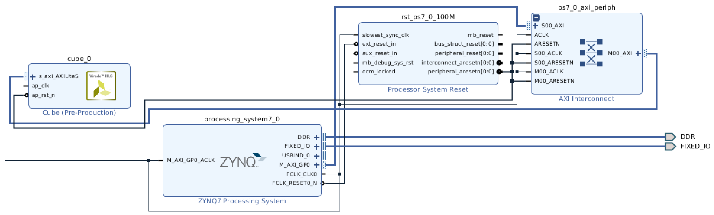

# pynqz2cuber
PYNQ 2020 course final project

The project introduces cuber IP y=x^3 using AXI light interface

uses the IP in overlay

and tests the IP functionality by means of MMIO driver in jupyter notebook
